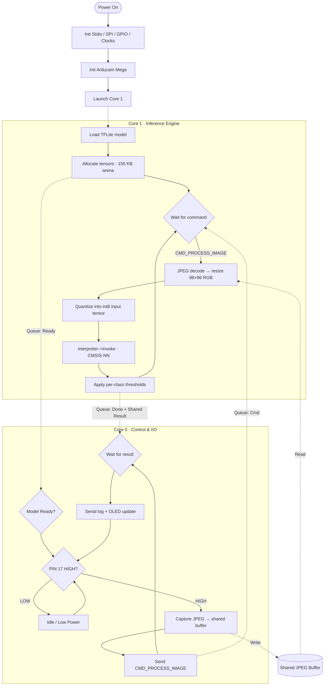
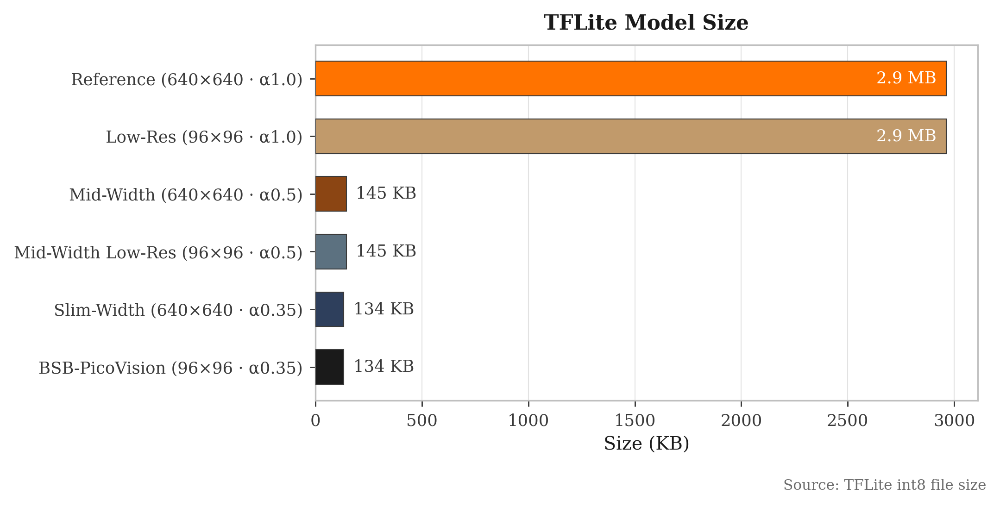
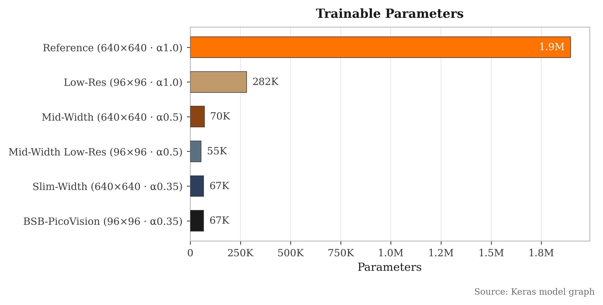
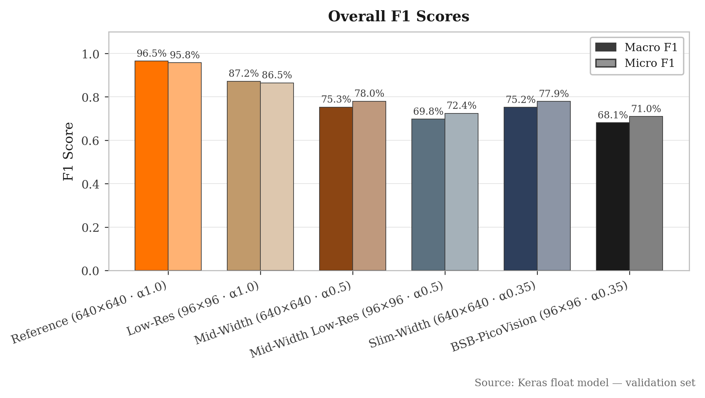
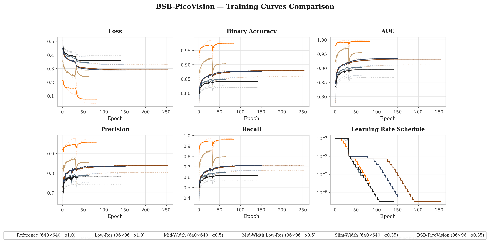
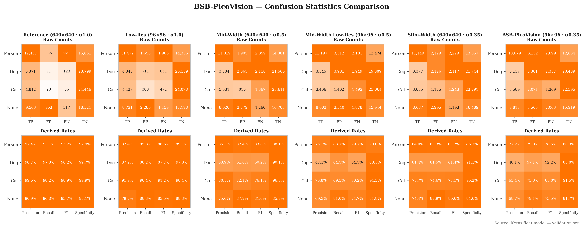
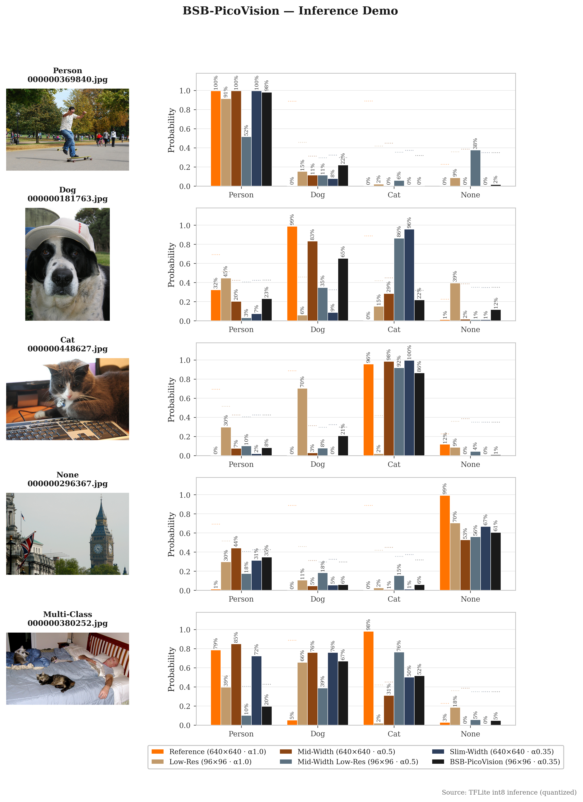

<div align="center">

# BSB-PicoVision
### Ultra-Low-Power Computer Vision for Social Robots


**A sub-1.0 W vision subsystem that recognizes interaction targets — _Person, Dog, Cat_ — on a $20 dual-core microcontroller, with no cloud, no GPU, and no Linux.**

-7b2ff7)


</div>

---

## Table of Contents

- [Overview](#overview)
- [Why This Matters](#why-this-matters)
- [Key Features](#key-features)
- [Hardware Architecture](#hardware-architecture)
- [System Architecture](#system-architecture)
- [Machine Learning Pipeline](#machine-learning-pipeline)
- [Architecture Sweep](#architecture-sweep)
- [Results](#results)
- [Repository Structure](#repository-structure)
- [Getting Started](#getting-started)
- [Firmware Internals](#firmware-internals)
- [Roadmap](#roadmap)
- [Author & Acknowledgments](#author--acknowledgments)

---

## Overview

Social robots need to know *who* and *what* is in front of them — a person to greet, a pet to
avoid, or an empty room to ignore — but the vision systems that usually provide this (NVIDIA
Jetson, Raspberry Pi 4 + camera) draw **5–10 W**, dominating the power budget of a small mobile
platform and crippling battery life.

**BSB-PicoVision** takes the opposite approach: a **hardware–software co-design** that pushes a
quantized convolutional neural network onto a **SparkFun Thing Plus RP2040** — a dual-core
Cortex-M0+ microcontroller — and splits the workload across both cores so that capture, control,
and inference run concurrently. The result is a self-contained vision module that performs
**multi-label classification** of *Person / Dog / Cat / None* entirely on-device, drawing under
**1.0 W**.

> **Multi-label, not multi-class:** the network emits an independent probability per class, so it
> can report a person *and* a dog in the same frame, or nothing at all.

---

## Why This Matters

| | Typical Edge Vision (Jetson / Pi) | **BSB-PicoVision** |
|---|---|---|
| **Compute** | GPU / quad-core Cortex-A | Dual Cortex-M0+ @ 133 MHz |
| **OS** | Linux | Bare-metal firmware |
| **Power** | 5–10 W | **< 0.5 W** |
| **Memory** | 1–8 GB DRAM | 264 KB SRAM |
| **Model** | Full FP32 CNN | **136 KB int8 CNN** |
| **Cost** | $60–$400 | ~$20 |

The contribution is not a new network — it is showing that a *carefully truncated, quantized
MobileNetV2*, paired with *asymmetric dual-core firmware* and *CMSIS-NN kernels*, is enough to do
useful real-world recognition in a power envelope two orders of magnitude smaller than the norm.

---

## Key Features

- **HW–SW Co-Design** — the network architecture and the firmware were tuned *together* to fit the
  RP2040's 264 KB SRAM and 133 MHz cores.
- **Asymmetric Dual-Core Pipeline** — Core 0 owns I/O and control; Core 1 is a dedicated inference
  engine. They communicate over `multicore_fifo` + shared memory, never blocking each other.
- **Full Int8 Quantization** — weights *and* activations are 8-bit, cutting the model to **136 KB**
  and enabling integer-only inference.
- **CMSIS-NN Acceleration** — optimized ARM kernels (`arm_convolve_1x1_s8_fast`,
  `arm_depthwise_conv_3x3_s8`) replace the reference ops for a large speedup.
- **Integrated Power Management** — the Thing Plus RP2040's on-board MCP73831 LiPo charger and
  MAX17048 fuel gauge make it a complete battery-powered node.
- **GPIO Power Gating** — PIN 17 gates the capture/inference loop, so the system idles in low-power
  until externally triggered.
- **Reproducible Training Pipeline** — dataset balancing, two-phase transfer learning, dynamic
  per-class thresholding, int8 export, and a unified metrics dashboard, all scripted.

---

## Hardware Architecture

| Component | Part | Role |
|-----------|------|------|
| **MCU** | SparkFun Thing Plus — RP2040 | Dual Cortex-M0+ @ 133 MHz, 264 KB SRAM, 16 MB flash |
| **Camera** | Arducam Mega 5MP (SPI) | Captures JPEG frames, downscaled to 96×96 RGB |
| **Display** | SSD1306 OLED (I²C / Qwiic) | Shows live class scores (optional) |
| **Charger** | MCP73831 (on-board) | Single-cell LiPo charging via USB-C |
| **Fuel Gauge** | MAX17048 (on-board) | Battery state-of-charge over I²C |
| **Power** | LiPo battery (JST) | Untethered operation |

### Pinout (RP2040 → Arducam Mega, SPI0)

| Signal | GPIO |
|--------|------|
| SCK    | 2    |
| COPI (MOSI) | 3 |
| CIPO (MISO) | 4 |
| CS     | 16   |
| Power-gate / trigger | 17 |

SPI runs at **16 MHz**; the OLED and fuel gauge share the Qwiic **I²C** bus.

<div align="center">

 

*Assembled prototype: Thing Plus RP2040 + Arducam Mega + SSD1306 OLED.*

</div>

---

## System Architecture

The firmware exploits both RP2040 cores so that frame acquisition never stalls inference and vice
versa. Cores hand off image and result buffers through a FIFO queue plus shared memory.



---

## Machine Learning Pipeline

### Model Architecture

A **truncated MobileNetV2** backbone (width multiplier **α = 0.35**), cut at `block_6_expand`, feeds
a lightweight custom classification head:

```
Input 96×96×3
  └─ Truncated MobileNetV2 (α=0.35, → 12×12×96)
       └─ Conv2D → BatchNorm
            └─ DepthwiseConv2D → BatchNorm
                 └─ Conv2D → GlobalAveragePooling
                      └─ Dropout(0.5) → Dense(64) → Dense(4, sigmoid)
```

| Property | Value |
|----------|-------|
| Input | 96 × 96 × 3 RGB |
| Output | 4 independent sigmoids (Person, Dog, Cat, None) |
| Total parameters | 206,526 (67,012 trainable) |
| Quantization | Full integer (int8 weights **and** activations) |
| TFLite size | **136 KB** (flash) |
| Tensor arena | **155 KB** (~58% of SRAM) |

### Dataset

Built from **COCO** (Common Objects in Context), remapping the relevant categories into a balanced
multi-label set:

- **146,819** total samples
- Person 39.8% · None 29.4% · Dog 16.5% · Cat 14.3%
- Balancing uses a **mixed strategy** — undersampling the majority (Person) while oversampling the
  minority classes (Dog, Cat) — produced by [`TensorFlow/Dataset.py`](TensorFlow/Dataset.py).

### Training Strategy

Two-phase **transfer learning with fine-tuning**, driven by [`TensorFlow/Train.py`](TensorFlow/Train.py):

| Phase | Epochs | Backbone | Learning Rate |
|-------|--------|----------|---------------|
| 1 — Warm-up | 32 | Frozen | 1e-3 |
| 2 — Fine-tune | 224 | Top layers unfrozen | 1e-5 |

- **Dynamic Threshold Adjustment** — every 4 epochs the per-class decision thresholds are re-searched
  over a grid to maximize F1, then EMA-smoothed and clipped. The final thresholds ship in each
  config's `metadata.json` and are applied on-device.
- **Int8 export** uses a 300-sample representative dataset for activation calibration.
- Visualization grids and training curves are logged throughout for inspection.

---

## Architecture Sweep

To choose the best accuracy-vs-cost trade-off for the RP2040, **six configurations** were trained
and compared — three MobileNetV2 width multipliers (**α = 0.35 / 0.5 / 1.0**) across two input
resolutions (**96×96** and **640×640**). Each run is saved to its own
`TensorFlow/export_a<alpha>_b6_<res>/` directory, and
[`metrics_dashboard.py`](TensorFlow/metrics_dashboard.py) aggregates them into the comparison plots
under `TensorFlow/Metrics/`.

| Config | Input | Params | TFLite | Macro F1 | Micro F1 |
|--------|:-----:|-------:|-------:|:--------:|:--------:|
| **α 0.35 @ 96** ⭐ *deployed* | 96 | 206 K | **136 KB** | 0.681 | 0.710 |
| α 0.5 @ 96 | 96 | 188 K | 148 KB | 0.698 | 0.724 |
| α 1.0 @ 96 | 96 | 3.10 M | 2.9 MB | 0.872 | 0.865 |
| α 0.35 @ 640 | 640 | 206 K | 136 KB | 0.752 | 0.779 |
| α 0.5 @ 640 | 640 | 220 K | 148 KB | 0.753 | 0.780 |
| α 1.0 @ 640 | 640 | 6.33 M | 2.9 MB | 0.965 | 0.958 |

**Why α 0.35 @ 96 ships:** the larger models are markedly more accurate, but the α = 1.0 variants
(2.9 MB) and the 640×640 inputs blow past the RP2040's SRAM once activation buffers are accounted
for. The **α 0.35 @ 96** configuration is the smallest footprint — a 136 KB model with a 155 KB
arena — leaving comfortable headroom on a 264 KB device while still recognizing the target classes.
The sweep makes the cost of that trade-off explicit and reproducible.

---

## Results

**Deployed model — α 0.35 @ 96, int8, on validation data:**

| Class | Precision | Recall | F1 |
|-------|:---------:|:------:|:---:|
| Person | 0.772 | 0.798 | **0.785** |
| Cat | 0.634 | 0.733 | **0.680** |
| None | 0.687 | 0.791 | **0.735** |
| Dog | 0.481 | 0.571 | **0.522** |
| **Macro** | — | — | **0.681** |

> Dog is the hardest class — visually closest to Cat and the most aggressively oversampled — and is
> the clearest target for future improvement. Larger sweep configs close most of this gap (see
> table above), confirming it is a capacity limit rather than a data-pipeline bug.

**On-device performance:**

- **Latency:** ~890 ms per inference (~1.1 FPS) on Core 1
- **Model:** 136 KB in flash
- **Tensor arena:** 155 KB (~58% of the RP2040's 264 KB SRAM)
- **Active inference power:**  0.66 W
- **Active idle power:**  0.34 W

<div align="center">










  


</div>

---

## Repository Structure

```
.
├── datasets/                           # COCO annotations & balanced label CSVs (images git-ignored)
│   └── coco/
│       ├── annotations/                #   instances_val2017.json
│       └── balanced_multilabel_*.csv   #   balanced train/val splits
├── TensorFlow/                         # Training & analysis (Python)
│   ├── Dataset.py                      #   Multi-label balancing (mixed under/oversampling)
│   ├── Train.py                        #   2-phase training + dynamic thresholds + int8 export
│   ├── metrics_dashboard.py            #   Aggregates all sweep runs into comparison plots
│   ├── export_a0.35_b6_96/             #   ⭐ Deployed config (α 0.35 @ 96)
│   ├── export_a0.5_b6_96/   ...        #   Sweep runs (α 0.5 / 1.0 × 96 / 640)
│   │   ├── best.keras                  #     Best Keras checkpoint
│   │   ├── BSB-PicoVision.tflite       #     Quantized int8 model
│   │   ├── model_data.h                #     C array for firmware
│   │   ├── metadata.json               #     Classes, thresholds, F1 scores
│   │   └── ...                         #     History, confusion stats, viz frames
│   └── Metrics/                        #   Cross-config plots (combined_*, individual_*, inference_*)
├── ThingPlus-TFMicro-CatDogPerson/     # RP2040 firmware (C/C++)
│   ├── src/
│   │   ├── main.cpp                    #     Dual-core application
│   │   ├── Arducam/                    #     Camera driver
│   │   ├── oled_ssd1306.*              #     OLED driver
│   │   ├── picojpeg.* / jpeg_decoder.* #     JPEG decode
│   │   └── model_data.h                #     Deployed model weights
│   ├── pico-tflmicro/                  #     TensorFlow Lite Micro + CMSIS-NN
│   ├── flowchart.mermaid               #     Firmware control-flow diagram
│   └── CMakeLists.txt                  #     Build configuration
├── Device Images/                      # Photos of the assembled hardware
└── README.md
```

---

## Getting Started

### Prerequisites

- **Hardware:** SparkFun Thing Plus RP2040, Arducam Mega 5MP, SSD1306 OLED (optional)
- **Firmware toolchain:** Raspberry Pi Pico SDK **2.1.1**, CMake ≥ 3.13, GCC-ARM (`14_2_Rel1`), `picotool`
- **Training (optional):** Python 3.x, TensorFlow, NumPy, pandas, OpenCV, matplotlib

> **Note on the dataset:** COCO source images (~121 GB) and the derived YOLO label files are
> **git-ignored**. Download COCO 2017 into `datasets/coco/images/` and regenerate labels with
> `Dataset.py` before training. The repo ships the annotations, balanced CSVs, and all trained model
> artifacts, so you can build and flash the firmware **without** the dataset.

### 1 — Build & Flash the Firmware

```bash
cd ThingPlus-TFMicro-CatDogPerson
mkdir build && cd build
cmake ..
make
```

Hold **BOOTSEL**, plug in the board, and copy the resulting `.uf2` onto the `RPI-RP2` drive (or
`picotool load BSB-PICOVISION.uf2`). Open a serial monitor at the default baud to watch live class
scores; if an OLED is attached they also render on-screen.

### 2 — (Optional) Reproduce the Training Pipeline

```bash
cd TensorFlow

# Prepare / balance the dataset (writes balanced_multilabel_*.csv)
python Dataset.py

# Two-phase training → exports best.keras, .tflite, model_data.h, metadata.json
python Train.py

# Aggregate every sweep run into the comparison dashboard (→ Metrics/)
python metrics_dashboard.py

# …optionally run sample images through every TFLite model:
python metrics_dashboard.py --samples person.jpg dog.jpg cat.jpg none.jpg
```

To deploy a newly trained model, copy its `export_*/model_data.h` into
`ThingPlus-TFMicro-CatDogPerson/src/` and rebuild.

---

## Firmware Internals

**Core 0 — Control & I/O**
- Initializes hardware and the Arducam Mega; captures JPEG frames (96×96 mode) into a shared buffer.
- Monitors **PIN 17** with an IRQ-based, debounced edge detector. When gating is enabled the capture
  loop pauses while PIN 17 is LOW, dropping the system into a low-power idle.
- Sends `CMD_PROCESS_IMAGE` to Core 1, waits for the result, and prints scores over serial / updates
  the OLED.

**Core 1 — Inference Engine**
- Loads the int8 TFLite model and allocates a **155 KB** tensor arena.
- Decodes the shared JPEG, resizes to 96×96 RGB, quantizes into the int8 input tensor, runs
  `interpreter->Invoke()`, and applies the per-class thresholds baked in at training time.
- Times each inference (`inference_time_ms`) and writes scores/predictions back to shared memory.

**Inter-core communication** uses `pico/util/queue` FIFOs to pass commands and completion signals,
with the JPEG buffer and `InferenceResult` living in shared memory — keeping the ISR short and the
two cores decoupled. A compile-time `CONSTANT_INFERENCE` switch toggles between always-on inference
and PIN-17 gated capture.

---

## Author & Acknowledgments

**Brady Barlow** — Oklahoma State University.

Developed as academic research into ultra-low-power, on-device computer vision for social robotics.
Built on the [Raspberry Pi Pico SDK](https://github.com/raspberrypi/pico-sdk),
[TensorFlow Lite for Microcontrollers](https://github.com/tensorflow/tflite-micro),
Arm **CMSIS-NN**, and the [COCO dataset](https://cocodataset.org/).
