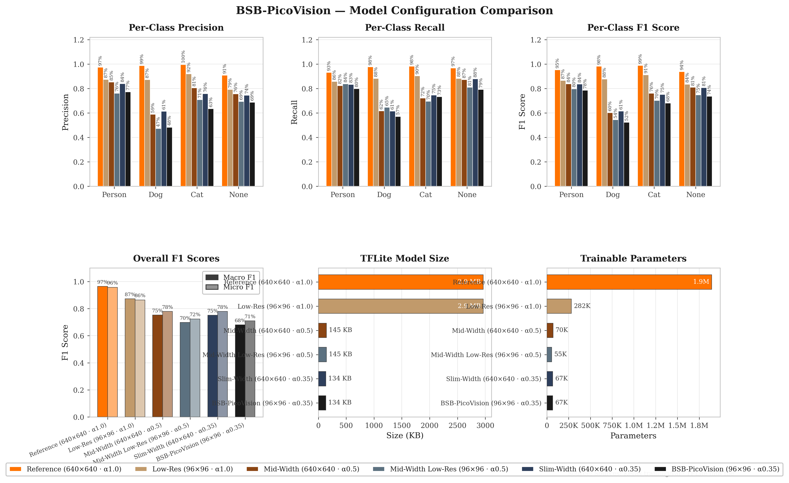
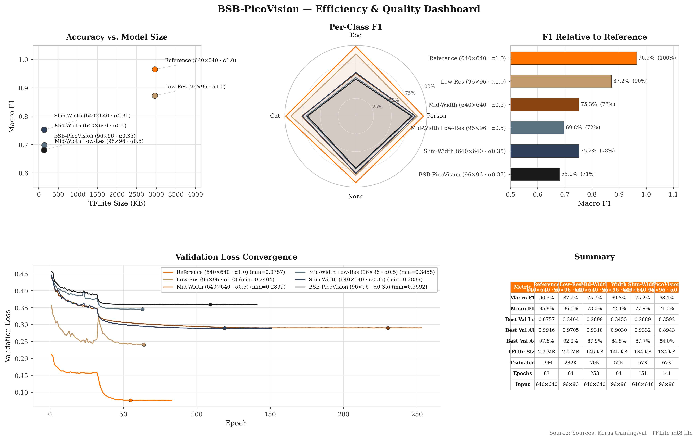

# Ultra Low Power Computer Vision for Social Robots


This project implements a vision subsystem for a mobile social robot, designed to identify interaction targets (Person, Dog, Cat) while maximizing battery life. It utilizes a Hardware-Software Co-Design approach, optimizing both the neural network architecture and dual-core firmware logic on the RP2040 microcontroller.

## 🚀 Project Overview

- **Objective:** Develop a low-power vision module (<0.5W) for social robots.
- **Problem:** High-performance vision systems (Jetson, Pi 4) consume too much power (5-10W).
- **Solution:** A custom MobileNetV2 model running on a SparkFun Thing Plus RP2040, leveraging dual-core processing for efficient inference without sacrificing real-time capabilities.

## ✨ Key Features

- **HW-SW Co-Design:** Optimized neural network architecture paired with asymmetric dual-core firmware.
- **Low Power Consumption:** Targets <0.5W active power consumption.
- **Integrated Power Management:** Uses the SparkFun Thing Plus RP2040's built-in LiPo charger and Fuel Gauge.
- **Efficient Inference:** Custom MobileNetV2 (Alpha 0.35) model with Int8 quantization.
- **Dual-Core Processing:**
  - **Core 0:** Control, I/O, Sensors, Display.
  - **Core 1:** Dedicated TFLite Micro Inference.

## 🛠 Hardware Architecture

| Component | Description |
|-----------|-------------|
| **MCU** | SparkFun Thing Plus - RP2040 (Dual-core Cortex-M0+ @ 133MHz, 16MB Flash) |
| **Camera** | Arducam Mega 5MP (SPI), scaled to 96x96 RGB for inference |
| **Display** | SSD1306 OLED (I2C/Qwiic) |
| **Power** | LiPo Battery (via JST), MCP73831 Charger, MAX17048 Fuel Gauge |

## 🧠 Machine Learning Pipeline

### Model Architecture
- **Backbone:** Truncated MobileNetV2 (Alpha 0.35), cutoff at `block_6_expand`.
- **Input:** 96x96x3 RGB Images.
- **Output:** 4 Classes (Person, Dog, Cat, None).
- **Quantization:** Full Integer (Int8) Quantization.
- **Size:** ~72.5k parameters (126KB model size).
- **Head:** Conv2D -> BN -> Depthwise -> BN -> Conv2D -> GAP -> Dropout -> Dense(64) -> Dense(4).

### Training
- **Dataset:** COCO (Common Objects in Context).
- **Stats:** 146,819 Total Samples (Person: 39.8%, Dog: 16.5%, Cat: 14.3%, None: 29.4%).
- **Strategy:** Transfer Learning with Fine-Tuning.
  - *Phase 1:* Frozen backbone (32 epochs).
  - *Phase 2:* Unfreeze top layers, fine-tune with low LR (224 epochs).
- **Balancing:** Mixed strategy (Undersampling majority, Oversampling minority).
- **Optimization:** Dynamic Threshold Adjustment to maximize F1-score per class.

### Architecture Sweep
To select the best accuracy-vs-cost trade-off for the RP2040, six configurations were
trained and compared — three MobileNetV2 width multipliers (`alpha` 0.35 / 0.5 / 1.0)
across two input resolutions (96×96 and 640×640). Each run is saved to its own
`TensorFlow/export_a<alpha>_b6_<res>/` directory, and `metrics_dashboard.py` aggregates
them into the comparison plots under `TensorFlow/Metrics/`. The **Alpha 0.35 @ 96×96**
configuration was selected for deployment as the best fit within the device's SRAM and
latency budget.

## 📂 Project Structure

```
.
├── datasets/                       # COCO annotations & balanced label CSVs (images are git-ignored)
├── TensorFlow/                     # Python scripts for model training & analysis
│   ├── Dataset.py                  # Data preparation and balancing (Mixed strategy)
│   ├── Train.py                    # 2-Phase training script with dynamic thresholding
│   ├── metrics_dashboard.py        # Aggregates all sweep runs into comparison plots
│   ├── export_a0.35_b6_96/         # Deployed config: alpha 0.35 @ 96x96 (sweep run)
│   ├── export_a0.5_b6_96/          # Sweep run: alpha 0.5 @ 96x96
│   ├── export_a1.0_96/             # Sweep run: alpha 1.0 @ 96x96
│   ├── export_a0.35_b6_640/        # Sweep run: alpha 0.35 @ 640x640
│   ├── export_a0.5_b6_640/         # Sweep run: alpha 0.5 @ 640x640
│   ├── export_a1.0_640/            # Sweep run: alpha 1.0 @ 640x640
│   │   ├── best.keras              #   Best Keras model
│   │   ├── BSB-PicoVision.tflite   #   Quantized TFLite model
│   │   ├── model_data.h            #   C++ header file for firmware
│   │   ├── metadata.json           #   Classes, thresholds, F1 scores
│   │   └── ...                     #   Training history, confusion stats, viz frames
│   └── Metrics/                    # Cross-config comparison plots (combined_*, individual_*, inference_*)
├── ThingPlus-TFMicro-CatDogPerson/ # Firmware for RP2040
│   ├── src/                        # C++ source code (main.cpp, drivers, Arducam, OLED)
│   ├── pico-tflmicro/              # TensorFlow Lite for Microcontrollers library
│   └── CMakeLists.txt              # Build configuration
├── Device Images/                  # Photos of the assembled hardware
└── README.md                       # This file
```

## ⚡ Firmware Implementation

The firmware utilizes the RP2040's dual cores to separate concerns and leverages CMSIS-NN kernels for optimization:

1.  **Core 0 (Control & I/O):**
    - Captures images from Arducam Mega.
    - Manages OLED display updates.
    - Handles power gating (GPIO 17).
    - Communicates results via UART.
2.  **Core 1 (Compute):**
    - Runs the TFLite Interpreter.
    - Performs inference on the image buffer in shared memory.
    - **Optimization:** Uses optimized CMSIS-NN kernels (`arm_convolve_1x1_s8_fast`, `arm_depthwise_conv_3x3_s8`) for faster execution.

**Inter-Core Communication:** Uses `multicore_fifo` to pass image buffer pointers in a non-blocking manner.

## 📊 Results







- **Inference Speed:** ~889ms per frame (~1.1 FPS).
- **Memory Footprint:**
  - Model: 126KB.
  - Tensor Arena: 153KB (~58% of SRAM).
- **Performance (F1-Score):**
  - **Person:** ~77%
  - **Dog:** ~55%
  - **Cat:** ~68%
  - **None:** ~73%
  - **Macro F1:** ~71%

## 🔧 Getting Started

### Prerequisites
- **Hardware:** SparkFun Thing Plus RP2040, Arducam Mega, SSD1306 OLED.
- **Software:**
  - Raspberry Pi Pico SDK.
  - CMake, Make, GCC-ARM-Embedded.
  - Python 3.x (for training).

### Build Instructions

1.  **Clone the repository:**
    ```bash
    git clone <repo_url>
    cd <repo_name>
    ```

2.  **Build Firmware:**
    ```bash
    cd ThingPlus-TFMicro-CatDogPerson
    mkdir build && cd build
    cmake ..
    make
    ```
    Flash the resulting `.uf2` file to your RP2040.

3.  **Python Tools (Optional):**
    
    *   **Prepare / balance the dataset:**
        ```bash
        cd TensorFlow
        python Dataset.py
        ```
    *   **Train Model:**
        ```bash
        python Train.py
        ```
    *   **Generate comparison dashboard (all sweep configs):**
        ```bash
        python metrics_dashboard.py
        # Optionally run sample images through every TFLite model:
        python metrics_dashboard.py --samples person.jpg dog.jpg cat.jpg none.jpg
        ```

